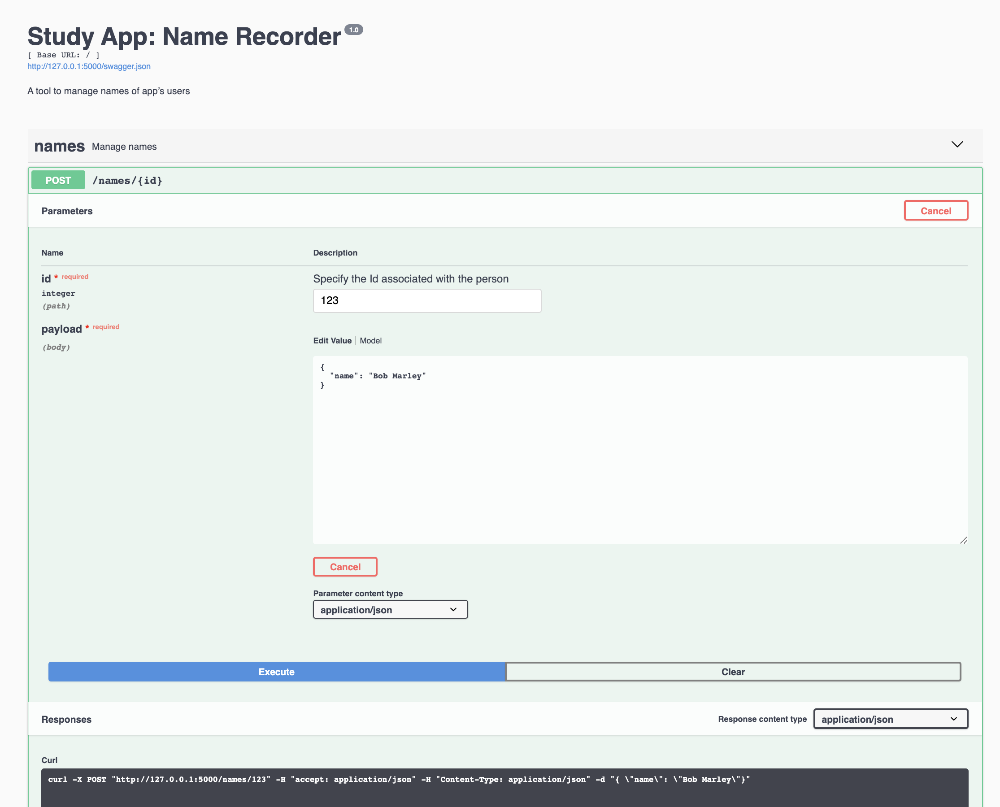

# Developing API with Flask, Flask-RESTPlus & Swagger

## Project description
This small study project explores capabilities of Python Flask &  Flask-RESTPlus frameworks in developing APIs.

Following BDD paradigm while developing ML-based services is considered a good practice so here I try to get a grasp of exposing Python backend to end-user while documenting all the POSTs and GETs.

## Starting the service
```bash
pip3 install --user -r requirements.txt
```
 then 
 ```python
 FLASK_APP=app.py flask run
 ```

 ## Swagger UI example
 
 